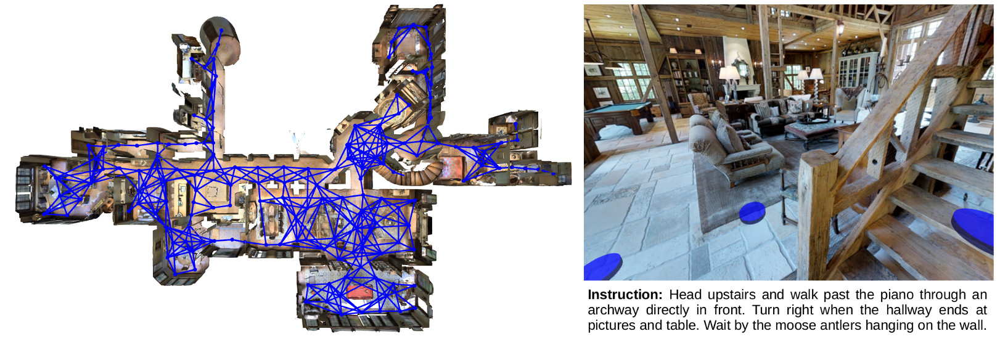
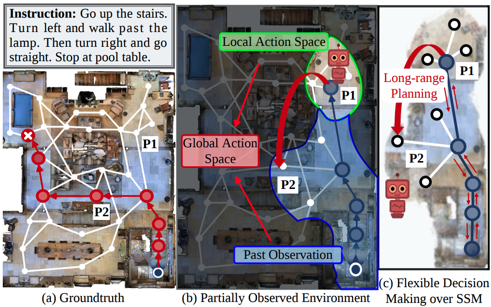
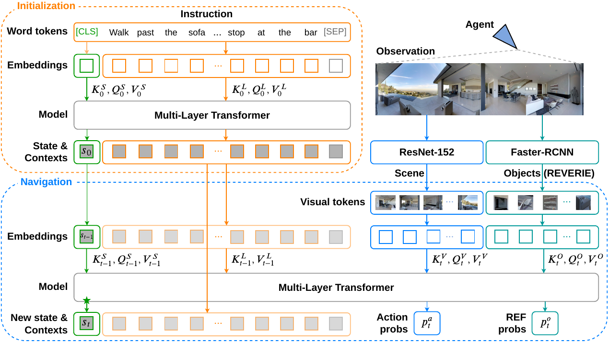
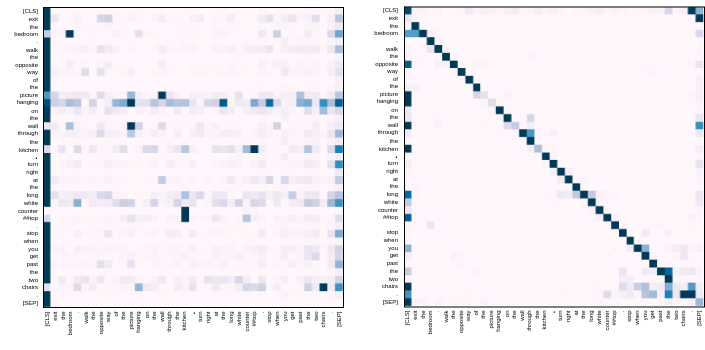
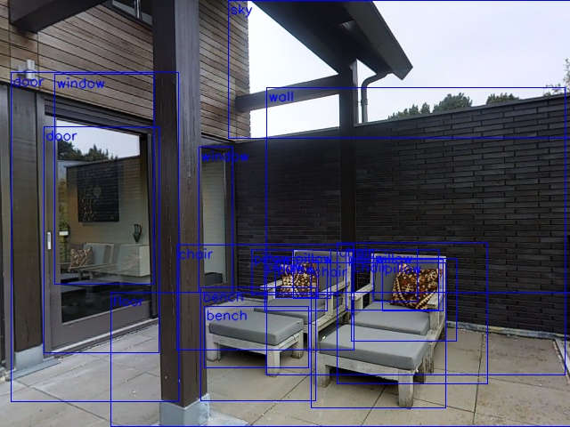

# Thinking-VLN
Some of my immature ideas and thoughts about the fascinating [Vision-and-Language Navigation](https://panderson.me/). :smiley: (last update 21.Mar.2021) --- OK, I DEFINITELY NEED TO UPDATE THIS PAGE ... :disappointed_relieved::disappointed_relieved: (19.May.2022)

Well... it has been three years, [WHERE IS MY SPOON???](https://bringmeaspoon.org/) :expressionless::expressionless::expressionless:

You can use this great collection of [papers of Embodied Vision](https://github.com/ChanganVR/awesome-embodied-vision) (for Navigation) by [Changan Chen](https://changan.io/) to learn more.

You are extremely welcome to comment and share your thoughts here! Just create an issue? :wink:

### Before worrying about the spoon

"*You shouldn't feel bad when someone else publishes a paper on the same idea you have been working on. That means we are on the right track and we have one less problem to solve. We can now move on to more interesting ideas.*" --- [Prof. Stephen Gould](http://users.cecs.anu.edu.au/~sgould/), my supervisor. :wink: It has been a great honor, great luck and great pleasure for me to work with him.

Cats are extremely helpful to research! I do [cloud cat-petting](https://space.bilibili.com/298946431/) everyday. Really hope I can have one by my side. :smiley_cat::kissing_cat:

"*I've seen things you people wouldn't believe. Attack ships on fire off the shoulder of Orion. I watched C-beams glitter in the dark near the Tannhäuser Gate. All those moments will be lost in time, like tears in rain.*" --- [Blade Runner 1982](https://www.imdb.com/title/tt0083658/).

### Some more serious thinkings

Wait, be careful. Perhaps nothing make sense. And PLEASE PLEASE PLEASE CORRECT ME IF I AM WRONG. :persevere::persevere: (last update 21.Mar.2021)

<a href="#1">1 - Are We Asking the Right Question?</a> 
<a href="#2">2 - About Memory Graph and Early Training</a> 
<a href="#3">3 - About Progress Monitor</a> 
<a href="#4">4 - About Pre-Training & Transformer</a> 
<a href="#5">5 - About Separating Visual Modalities</a> 
<a href="#6">6 - About Using Objects</a> 
<a href="#7">7 - Finally</a> 

### R2R-VLN Research Timeline

Fig. R2R-VLN Research Timeline (+ a few visual navigation papers).

-------------------------

### 1 - Are We Asking the Right Question?

Are we asking the right question in Vision-and-Language Navigation? Does the [R2R](https://arxiv.org/abs/1711.07280) and [RxR](https://arxiv.org/abs/2010.07954) tasks make sense? :thinking:

After working on the fascinating VLN for two years, I have started to question the question of "*asking a robot to navigate in previously unseen and photo-realistic environments following natural language instructions*".

Many papers sell the VLN application as a household robot, where the user can ask the robot to go to the kitchen and [bring him/her a spoon](https://bringmeaspoon.org/). The problem is, if we are talking about a household robot, why do we need to describe the path in such a comprehensive way? "*Exit the bathroom and turn right. Continue down the hall and turn left into the kitchen area. Once you enter the kitchen area turn right. Immediately turn right again. Wait in the smaller kitchen area in front of the sink.*" Couldn't I simply say "*Please bring me a spoon*"? :unamused: Moreover, if it is a household robot, why not simply ask it to navigate, to do some mappings and to get familiar with the environment first?

Well... I understand we are trying to solve an "easier" problem first. And we are solving it from the vision-and-language perspective, not really a navigation task. As for [REVERIE](https://github.com/YuankaiQi/REVERIE), those high-level instructions make much more sense to me, but directly learn to navigate with high-level instructions is way too difficult --- too much **commonsense** requried, wait... how to define *commonsense*??

Fig. Vision-and-Language Navigation (Peter Anderson et al., CVPR 2018).

[Self-Exploration](https://arxiv.org/abs/1811.10092) is a very inspiring self-supervised learning method, which "*is of practical benefit because it facilitates lifelong learning and adaption to new environments*". But whenever I think about mapping a new environment, I am not sure if self-exploration is still a good idea, afterall, the [Speaker](https://arxiv.org/abs/1806.02724) is defective and the training should be slow. That's why I didn't do pre-exploration in [FGR2R](https://arxiv.org/abs/2004.02707), [Entity-Graph](https://arxiv.org/abs/2010.09304) and [Recurrent-VLN-BERT](https://arxiv.org/abs/2011.13922).

I guess this is probably the reason why I became a big fan of the [Active Neural SLAM](https://www.cs.cmu.edu/~dchaplot/projects/neural-slam.html) by [Devendra Singh Chaplot](https://www.cs.cmu.edu/~dchaplot/projects/neural-slam.html), and his other great works such as [Neural Topological SLAM](https://arxiv.org/abs/2005.12256) and [Goal-Oriented Semantic Exploration](https://arxiv.org/abs/2007.00643). Soon after that, we really wanted to do SLAM for VLN, but Ta-Dah! [Topological Planning with TRMs for VLN](https://arxiv.org/abs/2012.05292), a very beautiful work by [Kevin Chen](https://cs.stanford.edu/~kchen92/), couldn't say we can do better. :wink::wink:

Simply "*bring me a spoon*" sounds like we don't need (natural) language at all, but that's definitely not how I picture VLN. I am thinking of an interactive senario, involving visual dialog, something like -- "*Please bring me a spoon*" "*On my way to kitchen...*" "*I think I left it on the dinning table yesterday.*" "*I can see a teaspoon and a soupsoon on the table...*" "*Soupspoon.*" "*Got it, on my way back.*" :relaxed: A (beautiful) task that allows pre-exploration-mapping, and combines visual-question-answering, referring expression, dialog, and navigation.

- Vision-and-Language Navigation: Interpreting Visually-Grounded Navigation Instructions in Real Environments
  - Peter Anderson et al., CVPR 2018. [ [paper](https://arxiv.org/abs/1711.07280) | [code](https://github.com/peteanderson80/Matterport3DSimulator) | [project page](https://bringmeaspoon.org/) ]
- Reinforced Cross-Modal Matching and Self-Supervised Imitation Learning for Vision-Language Navigation
  - Xin Wang et al., CVPR 2019. [ [paper](https://arxiv.org/abs/1811.10092) ]
- Learning to Explore using Active Neural SLAM
  - Devendra Singh Chaplot et al., ICLR 2020. [ [Habitat challenge winner](https://aihabitat.org/challenge/2019/) | [paper](https://openreview.net/pdf?id=HklXn1BKDH) | [code](https://github.com/devendrachaplot/Neural-SLAM) | [project page](https://www.cs.cmu.edu/~dchaplot/projects/neural-slam.html) ]
- Neural Topological SLAM for Visual Navigation
  - Devendra Singh Chaplot et al., CVPR 2020. [ [paper](https://arxiv.org/abs/2005.12256) | [project page](https://www.cs.cmu.edu/~dchaplot/projects/neural-topological-slam.html) ]
- Object Goal Navigation using Goal-Oriented Semantic Exploration
  - Devendra Singh Chaplot et al., NeurIPS 2020. [ [Habitat challenge winner](https://aihabitat.org/challenge/2020/) | [paper](https://arxiv.org/abs/2007.00643) | [project page](https://www.cs.cmu.edu/~dchaplot/projects/semantic-exploration.html) ]
- Topological Planning with Transformers for Vision-and-Language Navigation
  - Kevin Chen et al., arXiv 2021. [ [paper](https://arxiv.org/abs/2012.05292) ]

<!--[ [paper]() | [code]() | [project page]() ]-->
-------------------------

### 2 - About Memory Graph and Early Training

Under the current R2R-VLN setting. If the agent is very certain of its current position, why does it need to read/care about the previous sub-instructions? :confused::confused:

After the [Fine-Grained-R2R](https://arxiv.org/abs/2004.02707) paper, we were interested in upgrading the sub-instruction aware module to allow the attention to jump back and forth among sub-instructions. One idea was to build a **sub-instruction attention graph** where each node represents a sub-instruction and the language attention can travel through edges at each time step. Comparing to the baseline method which requires the agent to finish each sub-instruction sequentially, the motivation behind the **sub-instruction attention graph** was to allow the network to attend the correct sub-instruction when the agent corrects itself to the right path from mistaken steps.

I can understand the skipping (jumping forward), but back-tracking sub-instructions? Isn't that unnecessary? :thinking:

That leads me to re-think about early methods on back-tracking such as the [Regretful Agent](https://arxiv.org/abs/1903.01602) and [Tactical Rewind](https://arxiv.org/abs/1903.02547) as well as recent methods on memory buffer/graph, such as the [Evolving Graphical Planner](https://arxiv.org/abs/2007.05655), [Structured Scene Memory](https://arxiv.org/abs/2103.03454) and [Active Exploration](https://arxiv.org/abs/2007.08037). One common approach is to define a memory graph (relying on the connectivity map of the [Matterport3D environments](https://niessner.github.io/Matterport/)), which records all the visited viewpoints and all the navigable viewpoints along the way as the agent progresses.

Fig. Structured Scene Memory for Vision-Language Navigation (Hanqing Wang et al., arXiv 2021).

I think there are two key arguments here -- (1) **Effective exploration** and (2) **Error correction**. In my opinion, this method is expected to help **testing** (not training). However, after training for a long time in the training split (and very likely to overfit due to the small size of [R2R](https://arxiv.org/abs/1711.07280)), almost all the agents should be pretty confident of each decision and are mostly walking on the ground-truth path. In such late training stage, effective exploration and error correction shouldn't be useful to the agents anymore, I am afraid the agents' ability to explore and correct might degenerate or even be forgotten. :worried: I think the best way to validate is, instead of showing the improvement in the overall performance or a qualitative figure, **do a statistical analysis in testing, on how often/when the agent decises to explore and how often/when the agent corrects itself from mistakes (simply *go back* doesn't count, it should be the graph sending the decision signal), comparing to other agents without using a scene memory graph**. :relieved: I would say Table 3 in the [Regretful Agent](https://arxiv.org/abs/1903.01602) and Figure 5 in the [Tactical Rewind](https://arxiv.org/abs/1903.02547) are very good starts.

If I don't buy *exploration and correction* for testing, then why does the overall testing performance improved? My hypothesis is -- due to the large decision/search space provided by the memory graph, the agent is able to go further and learn more from failure **during the early stage of training**. Intuitively, not only learn about "*don't go into kitchen*" at a local space, but also has a chance to learn about "don't go into bedroom", "not the stairs", "not the livingroom"... (given the same instruction) in a single episode. Feels like relating to reinforcement learning and generalization ability -- not an expert in RL, but the agent seems to learn about some significant knowledge during the noisy exploration in early RL, and carries that knowledge to benefit exploitation in testing (not the curiosity of exploration :joy:). 

Ok... that was just a guess, will be glad to hear if someone oppose this hypothesis. :satisfied: Also, I think I should bring up several very interesting methods that enhance the VLN training, such as [Take the Scenic Route](https://arxiv.org/abs/2003.14269), [Adversarial Path Sampling](https://arxiv.org/abs/1911.07308), [Counterfactual VLN](https://papers.nips.cc/paper/2020/hash/39016cfe079db1bfb359ca72fcba3fd8-Abstract.html) and [Alternate Adversarial Learning](https://arxiv.org/abs/2011.10972).

Encourage exploration in early training or do adversarial/counterfactual learning...? Perhaps... simply collect more data is easier? Hopefully not. From the augmented samples generated by the [Speaker](https://arxiv.org/abs/1806.02724) to the huge amount of image-text-action triplets collected in [PREVALENT](https://arxiv.org/abs/2002.10638), and now we have [RxR](https://arxiv.org/abs/2010.07954)! The data has an increasing coverage of the environment, more diverse start-end pairs and instructions. More data versus more difficult data versus more exploration? :thinking: Could someone analyse the subset of testing samples which these methods solve? :stuck_out_tongue:

- Sub-Instruction Aware Vision-and-Language Navigation
  - Yicong Hong et al., EMNLP2020. [ [paper](https://arxiv.org/abs/2004.02707) | [FGR2R data](https://github.com/YicongHong/Fine-Grained-R2R) ]
- Room-Across-Room: Multilingual Vision-and-Language Navigation with Dense Spatiotemporal Grounding
  - Alexander Ku et al., EMNLP 2020. [ [paper](https://arxiv.org/abs/2010.07954) | [code](https://github.com/google-research-datasets/RxR) | [Habitat Challenge](https://github.com/jacobkrantz/VLN-CE/tree/rxr-habitat-challenge) ]
- The Regretful Agent: Heuristic-Aided Navigation through Progress Estimation
  - Chih-Yao Ma et al., CVPR 2019. [ [paper](https://arxiv.org/abs/1903.01602) | [code](https://github.com/chihyaoma/regretful-agent) | [project page](https://chihyaoma.github.io/project/2019/02/25/regretful.html) ]
- Tactical Rewind: Self-Correction via Backtracking in Vision-and-Language Navigation
  - Liyiming Ke et al., CVPR 2019. [ [paper](https://arxiv.org/abs/1903.02547) | [code](https://github.com/Kelym/FAST) ]
- Evolving Graphical Planner: Contextual Global Planning for Vision-and-Language Navigation
  - Zhiwei Deng et al., NeurIPS 2020. [ [paper](https://arxiv.org/abs/2007.05655) ]
- Structured Scene Memory for Vision-Language Navigation
  - Hanqing Wang et al., arXiv 2021. [ [paper](https://arxiv.org/abs/2103.03454) ]
- Active Visual Information Gathering for Vision-Language Navigation
  - Hanqing Wang et al., ECCV 2020. [ [paper](https://arxiv.org/abs/2007.08037) | [code](https://github.com/HanqingWangAI/Active_VLN) ]

<!--[ [paper]() | [code]() | [project page]() ]-->
-----------------------

### 3 - About Progress Monitor

I am wondering if the progress monitors defined in [Self-Monitoring](https://arxiv.org/abs/1901.03035) and [SERL](https://arxiv.org/abs/2007.10835) are learning about a dataset bias. Due to the fact that the predicted language attention weights is an input to the progress estimation module, the network could simply learns to **shift the attention weights as the agent progresses regardless whether the agent is on the right path**. :thinking: :thinking: 

Not sure if this problem is somehow reflected in Fig.(left) below, considering the low success rate in unseen split. I think the correct way of visualizing the language attention is to seperate the **successful and failure cases**, or take the **actual distance to target** into account.

[AuxRN](https://arxiv.org/abs/1911.07883) is similar but they use the attended language features instead of the weights. In their paper, they mentioned "*the attention map tends to be an uniform distribution when the agent gets lost*", but I am not sure how is that shown in Fig.(mid)... :thinking:

Fig. Language attention weights at each step (left: Self-Monitoring, mid: AuxRN, right: Recurrent-VLN-BERT).

[Recurrent-VLN-BERT](https://arxiv.org/abs/2011.13922) doesn't use progress monitor, but the language attention shows similar behaviour, Fig.(right) -- long live the [TRANSFORMER](https://arxiv.org/abs/1706.03762)!!! :joy: The dark region becomes thicker as the agent progresses, not sure if that is due to some short instructions in [R2R](https://github.com/peteanderson80/Matterport3DSimulator), or it reflects some failures cases -- the agent loses its way so it doesn't attend the last bit of the instruction (for stopping).

Perhaps a more rigorous way to argue about progress monitor is to talk about its regularization function in training -- a weak signal to guide the network to read the most relevant text while exploring ([monotonically aligned sequences](https://arxiv.org/abs/2004.02707)), rather than a prediction of the navigation progress. [RxR dataset](https://github.com/google-research-datasets/RxR) has much more diverse language and path lengths, should try on that. :grin::grin:

One more thing, the idea in [Fine-Grained-R2R](https://arxiv.org/abs/2004.02707) provides a very handy way to monitor the progress.

Oh, one more! Progress estimation helps back-tracking, take a look at the [Regretful Agent](https://arxiv.org/abs/1903.01602) if you are interested.

- Self-Monitoring: Self-Monitoring Navigation Agent via Auxiliary Progress Estimation
  - Chih-Yao Ma et al., ICLR 2019. [ [paper](https://arxiv.org/abs/1901.03035) | [code](https://github.com/chihyaoma/selfmonitoring-agent) | [project page](https://chihyaoma.github.io/project/2018/09/27/selfmonitoring.html) ]
- SERL: Soft Expert Reward Learning for Vision-and-Language Navigation
  - Hu Wang et al., ECCV 2020. [ [paper](https://arxiv.org/abs/2007.10835) ]
- AuxRN: Vision-Language Navigation with Self-Supervised Auxiliary Reasoning Tasks
  - Fengda Zhu et al., CVPR 2020. [ [paper](https://arxiv.org/abs/1911.07883) ]
- Recurrent-VLN-BERT: A Recurrent Vision-and-Language BERT for Navigation
  - Yicong Hong et al., CVPR 2021. [ [paper](https://arxiv.org/abs/2011.13922) | [code](https://github.com/YicongHong/Recurrent-VLN-BERT) ]

BTW, [Self-Monitoring](https://github.com/chihyaoma/selfmonitoring-agent) is where I started to get my hands dirty with VLN, a great paper! Thanks [Dr. Chih-Yao Ma](https://chihyaoma.github.io/)! :laughing:

<!--[ [paper]() | [code]() | [project page]() ]-->
-----------------------

### 4 - About Pre-Training & Transformer

Pre-trained [Transformer-based](https://arxiv.org/abs/1706.03762) visual-language models are amazing. 

For VLN, starting from [PRESS](https://arxiv.org/abs/1909.02244) which directly use the language features produced by a pre-trained [BERT](https://arxiv.org/abs/1810.04805). Then, [PREVALENT](https://github.com/weituo12321/PREVALENT) designs the Attended Masked Language Modeling (conditioned on images) and the Action Prediction objectives especially for VLN pre-training, but uses language features only for fine-tuning in downstream tasks. Later, [VLN-BERT](https://arxiv.org/abs/2004.14973) applies MLM to pre-train the network for estimating instruction-path compatibility.

I like our [Recurrent-VLN-BERT](https://github.com/YicongHong/Recurrent-VLN-BERT) for its simplicity and efficiency. We were looking for a way to allow the network to adequetly benefit from the pre-trained V&L knowledge for the VLN tasks. And the idea we came up with is simple enough -- use the [CLS] token as a recurrent link and cut away the entire downstream network -- **using BERT itself as the Navigator** -- it could also be a general network for many other problems which are defined as a partially observable Markov decision process (maybe only with short-term dependency? Not sure...) And finally, very efficient, a single RTX-2080Ti GPU for training to new SoTA (plus zero fine-tuning!). Hopefully I am not over-selling it. :stuck_out_tongue::stuck_out_tongue::stuck_out_tongue:

Fig. Schematics of the Recurrent Vision-and-Language BERT (OSCAR-based, https://github.com/microsoft/Oscar).

We started the project in a way very similar to [PREVALENT](https://arxiv.org/abs/2002.10638). [Cristian](https://crodriguezo.github.io/) and I designed five pre-training objectives: (1) Heading Angle Prediction, (2) Contrastive Instruction-Path Learning, (3) Stopping Prediction, (4) Sub-Instructions Permutation Learning and (5) Masked Verbs Modelling. We coded up lots of stuffs but soon we are frightened by the data and the compute requirement.

Guess not all the research group has the resources to run pre-training. "*Learn to use the pre-trained knowledge could be the next trend, rather than everyone doing the pre-training themselves*" --- [Dr. Qi Wu](http://www.qi-wu.me/), my secondary supervisor. :grinning::relieved:

On the other hand, it is great to see that Transformer is applied for achieving lots of other important functions in navigation, such as [Scene Memory](https://openaccess.thecvf.com/content_CVPR_2019/html/Fang_Scene_Memory_Transformer_for_Embodied_Agents_in_Long-Horizon_Tasks_CVPR_2019_paper.html), [Back-Translation](https://arxiv.org/pdf/2103.00852.pdf), and one of my favourite -- [Topological Mapping and Planning](https://arxiv.org/abs/2012.05292). :satisfied::satisfied:

- PRESS: Robust Navigation with Language Pretraining and Stochastic Sampling
  - Xiujun Li et al., EMNLP-IJCNLP 2019. [ [paper](https://arxiv.org/abs/1909.02244) ]
- PREVALENT: Towards Learning a Generic Agent for Vision-and-Language Navigation via Pre-training
  - Weituo Hao et al., CVPR 2020. [ [paper](https://arxiv.org/abs/2002.10638) | [code](https://github.com/weituo12321/PREVALENT) ]
- VLN-BERT: Improving Vision-and-Language Navigation with Image-Text Pairs from the Web
  - Arjun Majumdar et al., ECCV 2020. [ [paper](https://arxiv.org/abs/2004.14973) ]
- Recurrent-VLN-BERT: A Recurrent Vision-and-Language BERT for Navigation
  - Yicong Hong et al., CVPR 2021. [ [paper](https://arxiv.org/abs/2011.13922) | [code](https://github.com/YicongHong/Recurrent-VLN-BERT) ]
- Topological Planning with Transformers for Vision-and-Language Navigation
  - Kevin Chen et al., arXiv 2021. [ [paper](https://arxiv.org/abs/2012.05292) ]

<!--[ [paper]() | [code]() | [project page]() ]-->
-------------------

### 5 - About Separating Visual Modalities

Separating different visual modalities and applying independent language attentions is a very influential method in [AreYouLooking](https://arxiv.org/abs/1906.00347), [OAAM](https://arxiv.org/abs/2007.14626), and [Entity-Graph](https://arxiv.org/abs/2010.09304). For visual representations, instead of concatenating the scene (grid) features, object (regional) features and the directional encoding, methods above process these representations with specialized languages to facilitate the network for learning the noun-scene, noun-object and verb-direction correspondences. Of course, before making a decision, we need some methods to aggregate them.

Feels like mixture-of-experts, modular networks, disentangled representations ... and multi-head attention! :joy: "*Multi-head attention allows the model to jointly attend to information from different representation subspaces at different positions... individual attention heads clearly learn to perform different tasks, many appear to exhibit behavior related to the syntactic and semantic structure of the sentences*" --- [Attention Is All You Need](https://arxiv.org/abs/1706.03762). 

Hmm... [Recurrent-VLN-BERT](https://arxiv.org/abs/2011.13922) doesn't separate the scene features and the directional encoding, but it has multi-head attention. :smirk: Although not really interpretable. I really like this figure where Right: the attention on state ([CLS]) avoids all the key landmarks (nouns), while the nouns learned about co-occurrence (picture-wall, countertop-kitchen). Left: the state picks out all the landmarks.

Fig. Language self-attention weights of some selected heads in Recurrent-VLN-BERT.

- Are You Looking? Grounding to Multiple Modalities in Vision-and-Language Navigation
  - Ronghang Hu et al., ACL 2019. [ [paper](https://arxiv.org/abs/1906.00347) ]
- Object-and-Action Aware Model for Visual Language Navigation
  - Yuankai Qi et al., ECCV 2020. [ [paper](https://arxiv.org/abs/2007.14626) ]
- Language and Visual Entity Relationship Graph for Agent Navigation
  - Yicong Hong et al., NeurIPS 2020. [ [paper](https://arxiv.org/abs/2010.09304) | [code](https://github.com/YicongHong/Entity-Graph-VLN)  ]

<!--[ [paper]() | [code]() | [project page]() ]-->
-------------------

### 6 - About Using Objects

Objects in R2R-VLN? **Too sparse and too noisy**. Apart from [AreYouLooking](https://arxiv.org/abs/1906.00347), [Entity-Graph](https://arxiv.org/abs/2010.09304) and [DiagnosingEnvBias](https://arxiv.org/abs/2005.03086), I can't think of any other work that exploit objects in [Matterport3D](https://niessner.github.io/Matterport/) environment (important landmarks mentioned in [R2R](https://arxiv.org/abs/1711.07280) instructions). :thinking: We believe objects in instructions are extremely important because they "*allowing the agent to be aware of the exact progress of completing the instruction, providing strong localization signals to the agent in the environment and clarifying ambiguity for choosing a direction... use them for progress monitoring, instance tracking or reward shaping in reinforcement learning.*" ---[Entity-Graph](https://arxiv.org/abs/2010.09304). Feels like we should be able to design lots of interesting learning objectives based on objects.

It is too difficult for the network to learn the sparse, diverse and noisy object features only using the small [R2R dataset](https://arxiv.org/abs/1711.07280). Even for the [REVERIE dataset](https://arxiv.org/abs/1904.10151), where the object positions are given, it is still hard. One way to get around this problem, as in all the aforementioned papers [AreYouLooking](https://arxiv.org/abs/1906.00347), [Entity-Graph](https://arxiv.org/abs/2010.09304) and [DiagnosingEnvBias](https://arxiv.org/abs/2005.03086), is to use the word embeddings of the detected object labels instead of the object features. Such method also facilitates the attention to find out the correspondence between instruction and visual objects, because "*the agent only needs to learn the text-text correspondence rather than the hard text-visual correspondence*" ([Entity-Graph](https://arxiv.org/abs/2010.09304)). :confused::confused:

Fig. An example of detected objects in R2R-VLN.

What about those less valueable object labels in the detection? Such as sky, wall and floor? [Entity-Graph](https://arxiv.org/abs/2010.09304) further "*to simplify the object vocabulary and remove rare detections, we combine the 1,600 classes to 101 classes, where the 100 classes are the most frequent objects appear in both the instruction and the environment of the training data, and the remaining 1 class is others*", while [DiagnosingEnvBias](https://arxiv.org/abs/2005.03086) "*calculate the total areas of each detection object among all environments and pick the labels that take up a relatively large proportion of the environments*". Well... just a small but very helpful trick. :grimacing::grimacing:

NEVERTHELESS, maybe we don't need to worry about regional features at all, perhaps ResNet scene features already captured the salient objects, such as bathtub in bathroom, oven in kitchen and TV in livingroom. :sweat_smile::sweat_smile::sweat_smile:

Another very interesting finding in [Entity-Graph](https://arxiv.org/abs/2010.09304) is that "*there exists a large difference between the subset of unseen samples (a unique 10%) solved by our graph networks with objects and the subset (another unique 8%) solved by our graph networks without objects.*" Feels like too large to be noise, wondering if we can train a single network to solve all these samples.

- Are You Looking? Grounding to Multiple Modalities in Vision-and-Language Navigation
  - Ronghang Hu et al., ACL 2019. [ [paper](https://arxiv.org/abs/1906.00347) ]
- Language and Visual Entity Relationship Graph for Agent Navigation
  - Yicong Hong et al., NeurIPS 2020. [ [paper](https://arxiv.org/abs/2010.09304) | [code](https://github.com/YicongHong/Entity-Graph-VLN) ]
- Diagnosing the Environment Bias in Vision-and-Language Navigation
  - Yubo Zhang et al., IJCAI 2020. [ [paper](https://arxiv.org/abs/2005.03086) | [code](https://github.com/zhangybzbo/EnvBiasVLN) ]

<!--[ [paper]() | [code]() | [project page]() ]-->
-----------------------

### 7 - Finally

The greatest lesson I've learned in my PhD so far is never about how to publish a paper.

It's about how to learn, how to think, how to find a solution, how to plan, how to work with others and how to communicate. :relaxed::relaxed::relaxed:

<!-- Learn to persist, learn to respect, learn to be responsible, learn to be precise, learn to be open-minded, learn to be thankful, learn to be critical and generous. Learn to enjoy the great time at [ANU](https://www.anu.edu.au/), learn to value my own work and learn to contribute. :relaxed::relaxed::relaxed: -->

<!-- Thanks [Steve](http://users.cecs.anu.edu.au/~sgould/), thanks [Qi](http://www.qi-wu.me/), thanks [Cristian](https://crodriguezo.github.io/), thanks [Lexing](http://users.cecs.anu.edu.au/~xlx/), thanks [Yuankai](https://sites.google.com/site/yuankiqi/home) and thanks all my friends and colleagues at [ACRV](https://www.roboticvision.org/) & [CECS,ANU](https://cecs.anu.edu.au/). -->

Wait... Yicong, have you done all the experiments? NO!?? THEN GET BACK TO WORK!!! :angry::angry::angry:
