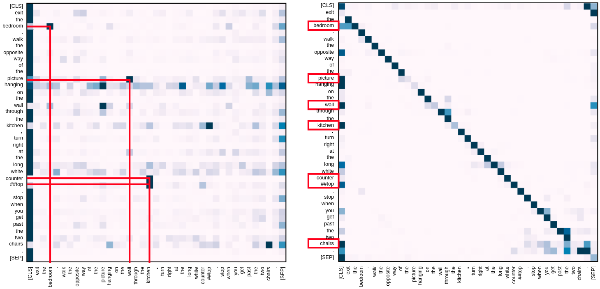

# Thinking-VLN
Some of my immature ideas and thoughts about the fascinating [Vision-and-Language Navigation](https://panderson.me/). :smiley: (last update 10.Mar.2021)

Well... it has been three years, [WHERE IS MY SPOON???](https://bringmeaspoon.org/) :expressionless::expressionless::expressionless:

You can use this great collection of [papers of Embodied Vision](https://github.com/ChanganVR/awesome-embodied-vision) (for Navigation) by [Changan Chen](https://changan.io/) to learn more.

You are extremely welcome to comment and share your thoughts here! :wink:

### Before worrying about the spoon

"*You shouldn't feel bad when someone else publishes a paper on the same idea you have been working on. That means we are on the right track and we have one less problem to solve. We can now focus on more interesting ideas.*" --- [Prof. Stephen Gould](http://users.cecs.anu.edu.au/~sgould/), my supervisor. :wink: It is a great honor, great luck and great pleasure for me to work with him.

Cats are extremely helpful to research! I do [cloud cat-petting](https://space.bilibili.com/298946431/) everyday. Really hope I can have one by my side. :smiley_cat::kissing_cat:

"*I've seen things you people wouldn't believe. Attack ships on fire off the shoulder of Orion. I watched C-beams glitter in the dark near the Tannhäuser Gate. All those moments will be lost in time, like tears in rain.*" --- [Blade Runner 1982](https://www.imdb.com/title/tt0083658/).

---------------

### Some more serious thinkings

Wait, be careful. Perhaps nothing make sense. And PLEASE PLEASE PLEASE CORRECT ME IF I AM WRONG. :persevere::persevere:

#### 1 - About Memory Graph and Early Training

<!--[ [paper]() | [code]() | [project page]() ]-->
-----------------------

#### 2 - Are We Asking the Right Question?

<!--[ [paper]() | [code]() | [project page]() ]-->
-----------------------

#### 3 - About Progress Monitor

I am wondering if the progress monitors defined in [Self-Monitoring](https://arxiv.org/abs/1901.03035) and [SERL](https://arxiv.org/abs/2007.10835) are learning about a dataset bias. Due to the fact that the predicted language attention weights is an input to the progress estimation module, the network could simply learns to **shift the attention weights as the agent progresses regardless whether the agent is on the right path**. :thinking: :thinking: 

Not sure if this problem is somehow reflected in Fig.(left) below, considering the low success rate in unseen split. I think the correct way of visualizing the language attention is to seperate the **successful and failure cases**, or take the **actual distance to target** into account.

[AuxRN](https://arxiv.org/abs/1911.07883) is similar but they use the attended language features instead of the weights. In their paper, they mentioned "*the attention map tends to be an uniform distribution when the agent gets lost*", but I am not sure how is that shown in Fig.(mid)... :confused:

Fig. Language attention weights at each step (left: Self-Monitoring, mid: AuxRN, right: Recurrent-VLN-BERT).

[Recurrent-VLN-BERT](https://arxiv.org/abs/2011.13922) doesn't use progress monitor, but the language attention shows similar behaviour, Fig.(right) -- long live the [TRANSFORMER](https://arxiv.org/abs/1706.03762)!!! :joy: The dark region becomes thicker as the agent progresses, not sure if that is due to some short instructions in [R2R](https://github.com/peteanderson80/Matterport3DSimulator), or it reflects some failures cases -- the agent loses its way so it doesn't attend the last bit of the instruction (for stopping).

Perhaps a more rigorous way to argue about progress monitor is to talk about its regularization function in training -- a weak signal to guide the network to read the most relevant text while exploring ([monotonically aligned sequences](https://arxiv.org/abs/2004.02707)), rather than a prediction of the navigation process. BTW, [RxR dataset](https://github.com/google-research-datasets/RxR) has much more diverse language and path lengths, should try on that. :grin::grin:

- Self-Monitoring: Self-Monitoring Navigation Agent via Auxiliary Progress Estimation
  - Chih-Yao Ma et al., ICLR 2019. [ [paper](https://arxiv.org/abs/1901.03035) | [code](https://github.com/chihyaoma/selfmonitoring-agent) | [project page](https://chihyaoma.github.io/project/2018/09/27/selfmonitoring.html) ]
- SERL: Soft Expert Reward Learning for Vision-and-Language Navigation
  - Hu Wang et al., ECCV 2020. [ [paper](https://arxiv.org/abs/2007.10835) ]
- AuxRN: Vision-Language Navigation with Self-Supervised Auxiliary Reasoning Tasks
  - Fengda Zhu et al., CVPR 2020. [ [paper](https://arxiv.org/abs/1911.07883) ]
- Recurrent-VLN-BERT: A Recurrent Vision-and-Language BERT for Navigation
  - Yicong Hong et al., CVPR 2021. [ [paper](https://arxiv.org/abs/2011.13922) | [code](https://github.com/YicongHong/Recurrent-VLN-BERT) ]

<!--[ [paper]() | [code]() | [project page]() ]-->
-----------------------

#### 4 - About Pre-Training & Transformer

Pre-trained [Transformer-based](https://arxiv.org/abs/1706.03762) visual-language models are amazing. 

For VLN, starting from [PRESS](https://arxiv.org/abs/1909.02244) which directly use the language features produced by a pre-trained [BERT](https://arxiv.org/abs/1810.04805). Then, [PREVALENT](https://github.com/weituo12321/PREVALENT) designs the Attended Masked Language Modeling (conditioned on images) and the Action Prediction objectives especially for VLN pre-training, but uses language features only for fine-tuning in downstream tasks. Later, [VLN-BERT](https://arxiv.org/abs/2004.14973) applies MLM to pre-train the network for estimating instruction-path compatibility.

I like our [Recurrent-VLN-BERT](https://github.com/YicongHong/Recurrent-VLN-BERT) for its simplicity and efficiency. We were looking for a way to allow the network to adequetly benefit from the pre-trained V&L knowledge for the VLN tasks. And the idea we came up with is simple enough -- use the [CLS] token as a recurrent link and cut away the entire downstream network -- **using BERT itself as the Navigator** -- it could also be a general network for many other problems which are defined as a partially observable Markov decision process (maybe with short-term dependency? Not sure... please see *About Memory Graph and Early Training*. And finally, very efficient, a single RTX-2080Ti GPU for training to new SoTA. Hope I am not over-selling it. :stuck_out_tongue::stuck_out_tongue::stuck_out_tongue:

We started the project in a way very similar to [PREVALENT](https://arxiv.org/abs/2002.10638). [Cristian](https://crodriguezo.github.io/) and I designed five pre-training objectives: (1) Heading Angle Prediction, (2) Contrastive Instruction-Path Learning, (3) Stopping Prediction, (4) Sub-Instructions Permutation Learning and (5) Masked Verbs Modelling. We coded up lots of stuffs but soon we are frightened by the data and the compute requirement.

Guess not all the research group has the resources to run pre-training. "*Learn to use the pre-trained knowledge could be the next trend, rather than everyone doing the pre-training themselves*" --- [Dr. Qi Wu](http://www.qi-wu.me/), my secondary supervisor. :grinning::relieved:

On the other hand, it is great to see that Transformer is applied for achieving lots of other important functions in navigation, such as [Scene Memory](https://openaccess.thecvf.com/content_CVPR_2019/html/Fang_Scene_Memory_Transformer_for_Embodied_Agents_in_Long-Horizon_Tasks_CVPR_2019_paper.html), [Back-Translation](https://arxiv.org/pdf/2103.00852.pdf), and one of my favourite -- [Topological Mapping and Planning](https://arxiv.org/abs/2012.05292). :satisfied::satisfied:

- PRESS: Robust Navigation with Language Pretraining and Stochastic Sampling
  - Xiujun Li et al., EMNLP-IJCNLP 2019. [ [paper](https://arxiv.org/abs/1909.02244) ]
- PREVALENT: Towards Learning a Generic Agent for Vision-and-Language Navigation via Pre-training
  - Weituo Hao et al., CVPR 2020. [ [paper](https://arxiv.org/abs/2002.10638) | [code](https://github.com/weituo12321/PREVALENT) ]
- VLN-BERT: Improving Vision-and-Language Navigation with Image-Text Pairs from the Web
  - Arjun Majumdar et al., ECCV 2020. [ [paper](https://arxiv.org/abs/2004.14973) ]
- Recurrent-VLN-BERT: A Recurrent Vision-and-Language BERT for Navigation
  - Yicong Hong et al., CVPR 2021. [ [paper](https://arxiv.org/abs/2011.13922) | [code](https://github.com/YicongHong/Recurrent-VLN-BERT) ]
- Topological Planning with Transformers for Vision-and-Language Navigation
  - Kevin Chen et al., arXiv 2021. [ [paper](https://arxiv.org/abs/2012.05292) ]

<!--[ [paper]() | [code]() | [project page]() ]-->
-------------------

#### 5 - About Separating Visual Modalities

Separating different visual modalities and applying independent language attentions is a very influential method in [AreYouLooking](https://arxiv.org/abs/1906.00347), [OAAM](https://arxiv.org/abs/2007.14626), and [Entity-Graph](https://arxiv.org/abs/2010.09304). For visual representations, instead of concatenating the scene (grid) features, object (regional) features and the directional encoding, methods above process these representations with specialized languages to facilitate the network for learning the noun-scene, noun-object and verb-direction correspondences. Of course, before making a decision, we need some methods to aggregate them.

Feels like mixture-of-experts, modular networks, disentangled representations ... and multi-head attention! :joy: "*Multi-head attention allows the model to jointly attend to information from different representation subspaces at different positions... individual attention heads clearly learn to perform different tasks, many appear to exhibit behavior related to the syntactic and semantic structure of the sentences*" --- [Attention Is All You Need](https://arxiv.org/abs/1706.03762). 

Hmm... [Recurrent-VLN-BERT](https://arxiv.org/abs/2011.13922) doesn't separate the scene features and the directional encoding, but it has multi-head attention. :smirk: Although not really interpretable. I really like this figure where Right: the attention on state ([CLS]) avoids all the key landmarks (nouns), while the nouns learned about co-occurrence (picture-wall, countertop-kitchen). Left: the state picks out all the landmarks.

Fig. Language self-attention weights of some selected heads in Recurrent-VLN-BERT.

- Are You Looking? Grounding to Multiple Modalities in Vision-and-Language Navigation
  - Ronghang Hu et al., ACL 2019. [ [paper](https://arxiv.org/abs/1906.00347) ]
- Object-and-Action Aware Model for Visual Language Navigation
  - Yuankai Qi et al., ECCV 2020. [ [paper](https://arxiv.org/abs/2007.14626) ]
- Language and Visual Entity Relationship Graph for Agent Navigation
  - Yicong Hong et al., NeurIPS 2020. [ [paper](https://arxiv.org/abs/2010.09304) | [code](https://github.com/YicongHong/Entity-Graph-VLN)  ]

<!--[ [paper]() | [code]() | [project page]() ]-->
-------------------

#### 6 - Using Objects

Objects in R2R-VLN? **Too sparse and too noisy**. Apart from [AreYouLooking](https://arxiv.org/abs/1906.00347) and [Entity-Graph](https://arxiv.org/abs/2010.09304), I can't think of any other work that exploit objects in [Matterport3D](https://niessner.github.io/Matterport/) environment (important landmarks mentioned in [R2R](https://arxiv.org/abs/1711.07280) instructions). :thinking: We believe objects in instructions are extremely important because they "*allowing the agent to be aware of the exact progress of completing the instruction, providing strong localization signals to the agent in the environment and clarifying ambiguity for choosing a direction.*" ---[Entity-Graph](https://arxiv.org/abs/2010.09304). Feels like we should be able to design lots of interesting learning objectives based on objects.

It is too difficult for the network to learn the sparse, diverse and noisy object features only using the small [R2R dataset](https://arxiv.org/abs/1711.07280). Even for the [REVERIE dataset](https://arxiv.org/abs/1904.10151), where the object positions are given, is still hard. One way to get around this problem, as in [AreYouLooking](https://arxiv.org/abs/1906.00347) and [Entity-Graph](https://arxiv.org/abs/2010.09304), is to use the word embeddings of the detected object labels instead of the object features. Such method also facilitates the attention to find out the correspondence between instruction and visual objects.

HOWEVER, maybe we don't need to worry about regional features at all, perhaps ResNet scene features already captured the salient objects, such as bathtub in bathroom, oven in kitchen and TV in livingroom. :sweat_smile::sweat_smile::sweat_smile:

- Are You Looking? Grounding to Multiple Modalities in Vision-and-Language Navigation
  - Ronghang Hu et al., ACL 2019. [ [paper](https://arxiv.org/abs/1906.00347) ]
- Language and Visual Entity Relationship Graph for Agent Navigation
  - Yicong Hong et al., NeurIPS 2020. [ [paper](https://arxiv.org/abs/2010.09304) | [code](https://github.com/YicongHong/Entity-Graph-VLN)  ]

<!--[ [paper]() | [code]() | [project page]() ]-->
-----------------------

### Finally

The greatest lesson I've learned in my PhD so far is never about how to publish a paper.

It's about how to learn, how to think, how to find a solution, how to plan, how to work with others and how to communicate.

Learn to persist, learn to respect, learn to be responsible, learn to be precise, learn to be open-minded, learn to be thankful, learn to be critical and generous. Learn to enjoy the great time at [ANU](https://www.anu.edu.au/), learn to value my own work and learn to contribute. :relaxed::relaxed::relaxed:

<!-- Thanks [Steve](http://users.cecs.anu.edu.au/~sgould/), thanks [Qi](http://www.qi-wu.me/), thanks [Cristian](https://crodriguezo.github.io/), thanks [Lexing](http://users.cecs.anu.edu.au/~xlx/), thanks [Yuankai](https://sites.google.com/site/yuankiqi/home) and thanks all my friends and colleagues at [ACRV](https://www.roboticvision.org/) & [CECS,ANU](https://cecs.anu.edu.au/). -->

Wait... Yicong, have you done all the experiments? NO!?? THEN GET BACK TO WORK!!! :angry::angry::angry:
